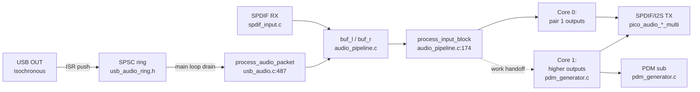
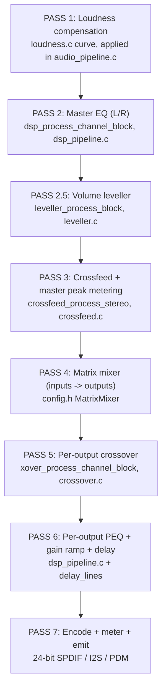
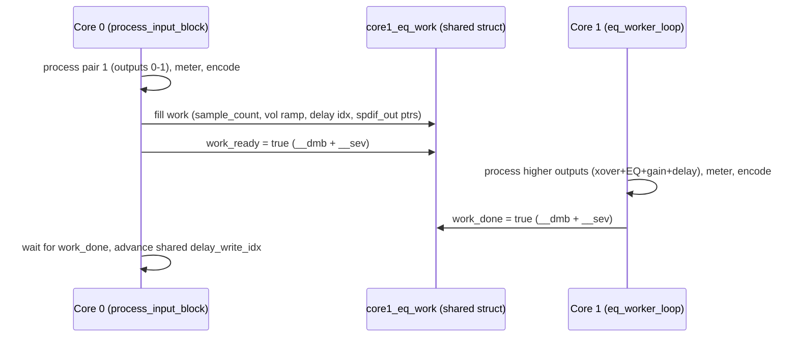
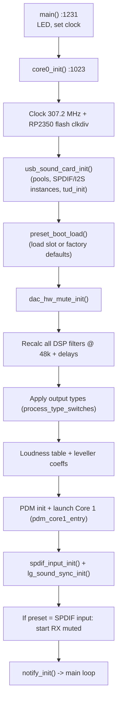
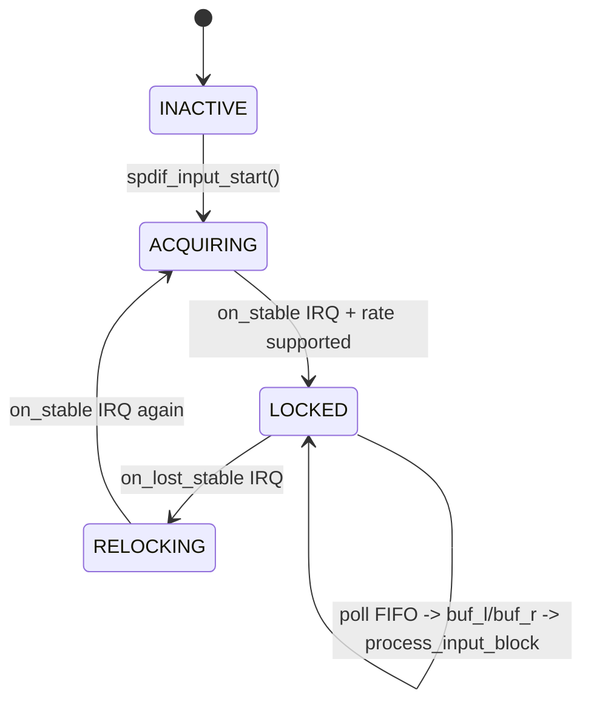
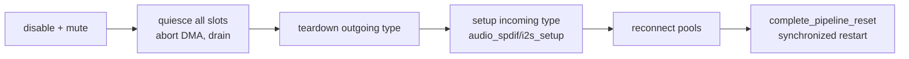

# DSPi Firmware Codebase Map

> **Purpose.** This is the "where is everything?" guide for the DSPi firmware. If you are new and want to find the code behind a feature (level meters, loudness, a vendor command, a preset field), start here. Every entry points you at a real file and an approximate line.
>
> **How to read the references.** Locations are written as `file.c:LINE`. Line numbers are a *snapshot* and drift as code changes; the **function/struct name is the durable anchor**. If a line is off by a few, search for the symbol. All paths are relative to `firmware/DSPi/` unless they start with `firmware/pico-extras/`.
>
> **Scope.** This maps the firmware (`firmware/DSPi/`) and the Pico audio libraries it depends on. It does not cover the host application, build system internals, or the SDK.

---

## Table of Contents

1. [How to Use This Map](#1-how-to-use-this-map)
2. [Repository Layout](#2-repository-layout)
3. [Platform Cheat Sheet (RP2040 vs RP2350)](#3-platform-cheat-sheet-rp2040-vs-rp2350)
4. [The 30-Second Mental Model](#4-the-30-second-mental-model)
   - [4.1 End-to-end signal flow](#41-end-to-end-signal-flow)
   - [4.2 The DSP pipeline passes](#42-the-dsp-pipeline-passes)
   - [4.3 Dual-core division of labor](#43-dual-core-division-of-labor)
5. [Where Do I Find...? (Quick Index)](#5-where-do-i-find-quick-index)
6. [Subsystem Reference](#6-subsystem-reference)
   - [6.1 Boot & Orchestration (`main.c`)](#61-boot--orchestration-mainc)
   - [6.2 Audio Inputs (USB / SPDIF / source switching / LG Sound Sync)](#62-audio-inputs)
   - [6.3 DSP Pipeline Core](#63-dsp-pipeline-core)
   - [6.4 DSP Feature Modules](#64-dsp-feature-modules)
   - [6.5 Level Metering & Clip Detection](#65-level-metering--clip-detection)
   - [6.6 Outputs (SPDIF / I2S / PDM / DAC mute)](#66-outputs)
   - [6.7 Dual-Core Workers](#67-dual-core-workers)
   - [6.8 USB Stack (descriptors / UAC1 driver / feedback)](#68-usb-stack)
   - [6.9 Control Surface (vendor commands / notifications)](#69-control-surface)
   - [6.10 Persistence (flash / presets / bulk params)](#610-persistence)
   - [6.11 Pico Audio Libraries](#611-pico-audio-libraries)
7. [Data Model Reference](#7-data-model-reference)
8. [Vendor Command Reference (Complete)](#8-vendor-command-reference-complete)
9. [Concurrency & Timing Rules](#9-concurrency--timing-rules)
10. [Glossary](#10-glossary)
11. [Maintaining This Document](#11-maintaining-this-document)

---

## 1. How to Use This Map

- **"I need to change feature X."** Jump to [Section 5](#5-where-do-i-find-quick-index) ("Where do I find...?"), find the feature, follow the file/line, then read that subsystem in [Section 6](#6-subsystem-reference).
- **"I'm adding a new vendor command."** Read [6.9 Control Surface](#69-control-surface) and the [Vendor Command Reference](#8-vendor-command-reference-complete). Commands are `#define`d in `config.h` and handled in `vendor_commands.c`.
- **"I'm touching the audio path."** Read [4.2](#42-the-dsp-pipeline-passes), [6.3](#63-dsp-pipeline-core), and **especially** [Section 9](#9-concurrency--timing-rules) (slot alignment is inviolable; never change coefficients while Core 1 is mid-block).
- **"I'm adding a persisted setting."** Read [6.10 Persistence](#610-persistence): you will touch `PresetSlot` (flash version bump) **and** `WireBulkParams` (wire version bump) **and** `bulk_params_collect/apply`.

**Golden rules before you commit anything in the audio path:**
- Inter-output sample alignment is sacred. Never let the four SPDIF instances, I2S slots, and PDM drift relative to each other.
- Never block the main loop or an ISR. Real-time work (USB ISR, audio callback, SOF) must stay non-blocking; slow or flash-touching work is deferred to the main loop via `*_pending` flags (see [Section 9](#9-concurrency--timing-rules)).
- After firmware changes, update `Documentation/current_architecture.md`.

---

## 2. Repository Layout

```
firmware/
├── DSPi/                         <- the application firmware (this map's focus)
│   ├── main.c                    Boot, Core 0 main loop, deferred-op orchestration
│   ├── usb_audio.c/.h            Custom UAC1 class driver, ring consumer, output slots
│   ├── usb_descriptors.c/.h      Hand-rolled UAC1 descriptors + MS OS 2.0 (WinUSB)
│   ├── usb_feedback_controller.c/.h  Async USB feedback servo (rate + fill)
│   ├── usb_audio_ring.h          Lock-free SPSC ring (USB ISR -> main loop)
│   ├── vendor_commands.c/.h      Control-transfer dispatcher (all REQ_* commands)
│   ├── audio_pipeline.c/.h       The DSP pipeline (PASS 1..N), per-block processing
│   ├── dsp_pipeline.c/.h         Filter coefficient design + biquad/SVF processing
│   ├── dsp_process_rp2040.S      Hand-tuned Q28 biquad kernels (RP2040/Cortex-M0+)
│   ├── dcp_inline.h              RP2350 double-coprocessor inline helpers
│   ├── crossover.c/.h            High-order crossovers (LR / Butterworth / Bessel)
│   ├── crossfeed.c/.h            BS2B headphone crossfeed
│   ├── loudness.c/.h             ISO 226 equal-loudness compensation tables
│   ├── leveller.c/.h             Volume leveller (RMS compressor)
│   ├── pdm_generator.c/.h        PDM sub output + Core 1 dispatch (PDM / EQ worker)
│   ├── spdif_input.c/.h          SPDIF RX integration, lock state, clock servo
│   ├── i2s_input.c/.h (+.pio)    I2S RX integration: master/slave PIO programs, IRQ-less DMA ring
│   ├── audio_input.c/.h          Input-source abstraction (USB / SPDIF / I2S)
│   ├── lg_sound_sync.c/.h        LG TV volume/mute via SPDIF channel status
│   ├── dac_hw_mute.c/.h          Hardware DAC mute GPIO (glitch-free resets)
│   ├── notify.c/.h               Device->host change notifications (EP 0x83)
│   ├── flash_storage.c/.h        10-slot preset system, directory, factory defaults
│   ├── bulk_params.c/.h          Whole-DSP-state wire format (GET/SET all params)
│   ├── flash_clkdiv.c/.h         RP2350 QMI flash clock-divider management
│   └── config.h                  Channel enums, platform counts, structs, REQ_* IDs
└── pico-extras/src/rp2_common/
    ├── pico_audio_spdif_multi/   Multi-instance SPDIF TX (PIO + DMA, BMC encode)
    ├── pico_audio_i2s_multi/     Multi-instance I2S TX (+ optional hardware MCK)
    └── pico_spdif_rx/            SPDIF receiver (PIO BMC decode, Fs detect, C bits)
```

**Biggest files (where the complexity lives):** `main.c` (~2155 lines), `vendor_commands.c` (~2047), `flash_storage.c` (~1941), `usb_audio.c` (~1640), `audio_pipeline.c` (~1066).

Feature specs live in `Documentation/Features/*.md`; the living architecture doc is `Documentation/current_architecture.md`.

---

## 3. Platform Cheat Sheet (RP2040 vs RP2350)

The single most important thing to internalize: **the same source builds two very different audio engines.** Conditionals are `#if PICO_RP2350` / `#else`.

| Aspect | RP2040 (Cortex-M0+) | RP2350 (Cortex-M33) |
|---|---|---|
| Sample format | **Q28 fixed-point** (`int32_t`) | **IEEE 754 float** |
| Biquad kernel | Assembly (`dsp_process_rp2040.S`), `fast_mul_q28` | C, hybrid **SVF/TDF2** (`dsp_pipeline.c`) |
| Filter low-freq path | TDF2 only | SVF below ~Fs/7.5, TDF2 above |
| SPDIF instances | **2** (`NUM_SPDIF_INSTANCES`) | **4** |
| Output channels | **5** (`NUM_OUTPUT_CHANNELS`) | **9** |
| Total channels | **7** (`NUM_CHANNELS`) | **11** |
| Pin outputs | **3** (`NUM_PIN_OUTPUTS`) | **5** |
| Core 1 EQ worker handles | pair 2 (outputs 2-3) | pairs 2-4 (outputs 2-7) |
| Max delay | `MAX_DELAY_SAMPLES` = **1024** (21 ms) | **2048** (42 ms) |
| Defined in | `config.h:90`, `409-410`, `437-438` | `config.h:88`, `406-407`, `432-433` |

Build commands:
```
cmake --build build-rp2040 --clean-first
cmake --build build-rp2350 --clean-first
arm-none-eabi-size build-rp2040/DSPi/DSPi.elf   # check BSS/RAM
```
**Always build both** after changing shared code.

---

## 4. The 30-Second Mental Model

### 4.1 End-to-end signal flow



Two things feed the pipeline: USB audio (decoded from the ring in the main loop, **not** the ISR) or SPDIF input. Both land in `buf_l`/`buf_r` and call the one pipeline entry point, `process_input_block()`.

### 4.2 The DSP pipeline passes

`process_input_block()` (`audio_pipeline.c:174`) runs these stages on each ~192-sample block. The RP2350 float path and RP2040 Q28 path are two big `#if` branches with identical structure.



The chain position of each feature is fixed; if you add a stage, decide where it belongs relative to these. Master volume is applied at the **output gain** stage (PASS 6/7), not in the DSP stages, so it does not affect loudness/leveller/EQ.

### 4.3 Dual-core division of labor



Core 1 has three mutually exclusive modes (`Core1Mode`, `config.h:473`): `IDLE`, `PDM` (subwoofer modulation), `EQ_WORKER` (parallel output processing). Dispatch lives in `pdm_core1_entry()` (`pdm_generator.c:714`). **PDM and EQ-worker cannot run together** — that mutual exclusion is enforced when outputs are enabled.

---

## 5. Where Do I Find...? (Quick Index)

The rookie's lookup table. Find your topic, jump to the code.

### Audio processing

| I'm looking for... | Start here |
|---|---|
| The main DSP pipeline entry | `process_input_block()` — `audio_pipeline.c:174` |
| Loudness (equal-loudness) curve math | `loudness_recompute_table()` — `loudness.c:170` |
| Loudness applied to audio | PASS 1 in `audio_pipeline.c` (`loudness_state` / `loudness_biquads`) |
| Volume leveller (compressor) | `leveller_process_block()` — `leveller.c:148` (float) / `:275` (Q28) |
| Crossfeed (headphone) | `crossfeed_process_stereo()` — `crossfeed.c:132` / `:161` |
| Crossover filters (LR/BW/Bessel) | `crossover.c`; design `xover_design_filter():549`, run `xover_process_channel_block():737` |
| Parametric EQ coefficient design | `dsp_compute_coefficients()` — `dsp_pipeline.c:71` |
| Biquad processing (RP2350) | `dsp_process_channel_block()` — `dsp_pipeline.c:297` |
| Biquad processing (RP2040 asm) | `dsp_process_channel_block` — `dsp_process_rp2040.S:262` |
| Matrix mixer (routing) | `MatrixMixer` struct `config.h:540`; PASS 4 in `audio_pipeline.c` |
| Per-output gain / mute / delay | `OutputChannel` `config.h:529`; PASS 6 in `audio_pipeline.c` |
| Channel delay lines | `delay_lines[]`, `dsp_update_delay_samples()` — `dsp_pipeline.c:227` |
| PDM sigma-delta modulator | `pdm_processing_loop()` — `pdm_generator.c:203` |

### Metering, status, levels

| I'm looking for... | Start here |
|---|---|
| **Level / peak meters** | `global_status.peaks[]` (`config.h:619`); computed in `audio_pipeline.c` PASS 3/7 & `pdm_generator.c` |
| **Clip detection** | `global_status.clip_flags`; thresholds `CLIP_THRESH_F`/`CLIP_THRESH_Q28` `config.h:50-54` |
| Peaks/clips exposed to host | `REQ_GET_STATUS` (0x50) & `REQ_CLEAR_CLIPS` (0x83) — `vendor_commands.c:1053`, `:1368` |
| CPU load meters (core 0/1) | `cpu0_load_q8` (`audio_pipeline.c`), `pdm_load_q8`/`c1eq_load_q8` (`pdm_generator.c`) |
| Buffer fill / watermarks | `get_slot_consumer_fill()` — `audio_pipeline.c:1005`; `REQ_GET_BUFFER_STATS` (0xB0) |

### Volume & gain

| I'm looking for... | Start here |
|---|---|
| USB host volume slider | `audio_set_volume()` — `usb_audio.c:465` |
| Volume funnel (all owners) | `apply_vol_index_to_audio()` — `usb_audio.c:437` |
| Device master volume ceiling | `update_master_volume()` — `usb_audio.c:300` |
| Per-input preamp | `update_preamp()` — `usb_audio.c:285`; `global_preamp_*` arrays |
| Per-output gain | `REQ_SET_OUTPUT_GAIN` (0x74) — `vendor_commands.c:652` |

### Inputs

| I'm looking for... | Start here |
|---|---|
| USB audio packet decode | `process_audio_packet()` — `usb_audio.c:487` |
| SPDIF input poll / decode | `spdif_input_poll()` — `spdif_input.c:238` |
| SPDIF clock servo | `spdif_input_update_clock_servo()` — `spdif_input.c:352` |
| I2S input poll / decode | `i2s_input_poll()` in `i2s_input.c`; start/stop/resync in same file |
| I2S input role election | `i2s_input_should_be_master()` in `main.c` (master only when no I2S outputs) |
| Input source switch (USB<->SPDIF<->I2S) | `audio_input.c` flags; handler in `main.c` (~2230) |
| LG Sound Sync (TV volume) | `lg_sound_sync_tick()` — `lg_sound_sync.c:351` |

### Outputs

| I'm looking for... | Start here |
|---|---|
| Output slot type (SPDIF vs I2S) | `output_types[]` `usb_audio.c:1420`; switch in `process_type_switches()` `main.c:229` |
| SPDIF TX library | `firmware/pico-extras/.../pico_audio_spdif_multi/audio_spdif.c` |
| I2S TX library + MCK | `firmware/pico-extras/.../pico_audio_i2s_multi/audio_i2s_multi.c` |
| DAC hardware mute | `dac_hw_mute.c` (`dac_hw_mute_assert():318`, `_release():340`) |
| Output pin reassignment | `process_pin_changes()` — `main.c:489` |

### Control & persistence

| I'm looking for... | Start here |
|---|---|
| Any host command (REQ_*) | dispatch `tud_vendor_control_xfer_cb()` `vendor_commands.c:1954`; see [Section 8](#8-vendor-command-reference-complete) |
| Preset save / load | `preset_save()` `flash_storage.c:1301`, `preset_load()` `:1330` |
| Factory defaults | `apply_factory_defaults()` — `flash_storage.c:1821` |
| Whole-state GET/SET | `bulk_params_collect()` `bulk_params.c:81`, `bulk_params_apply()` `:256` |
| Device->host notifications | `notify.c` (`notify_param_write():204`) |
| USB descriptors | `usb_descriptors.c` |

---

## 6. Subsystem Reference

### 6.1 Boot & Orchestration (`main.c`)

**Role.** System hub: boots both cores, runs the Core 0 main loop, and **serializes every disruptive operation** (rate change, preset load, output reconfig, flash write) so it never races the audio path. This is the file that enforces the "slots never drift" rule.

**Boot sequence** (`core0_init()` at `main.c:1023`, called from `main()` at `:1231`):



**Key functions:**

| Function | Location | What it does |
|---|---|---|
| `main` | `main.c:1231` | Entry; LED, clock, then `core0_init()`, then the forever loop |
| `core0_init` | `main.c:1023` | Full boot init (clocks, USB, presets, DSP, Core 1, inputs) |
| `perform_rate_change` | `main.c:104` | Deferred Fs switch: mute, recalc filters, update PIO dividers, reset feedback |
| `process_type_switches` | `main.c:229` | SPDIF<->I2S transition (teardown/setup, master election, sync restart) |
| `process_pin_changes` | `main.c:489` | Reassign output data pins, restart all outputs in sync |
| `prepare_pipeline_reset` | `main.c:575` | Phase 1 reset: fence Core 1, arm soft-mute, assert DAC mute |
| `pipeline_reset_ready` | `main.c:626` | Non-blocking gate: has the DAC-mute hold elapsed? |
| `complete_pipeline_reset` | `main.c:757` | Phase 2/3: per-slot teardown, **synchronized** PIO restart, feedback reset |
| `teardown_output_slot` | `main.c:684` | Per-slot quiesce (disable PIO, abort DMA, drain consumer) |
| `enable_outputs_in_sync` | `main.c:812` | Restart all output slots sample-aligned after prefill |
| `prepare_flash_write_operation` | `main.c:868` | Pre-flash: drain input, mute, settle, suspend RX |
| `complete_flash_write_operation_full/light` | `main.c:982` / `:1010` | Post-flash restart paths |

The Core 0 main loop (`main.c:1245`+) is a giant dispatcher of deferred work: USB task, notifications, DAC mute tick, audio drain, SPDIF poll/servo, then a long series of `if (xxx_pending && pipeline_reset_ready())` blocks for rate changes, EQ updates, preset ops, type/pin changes, bulk params, and input-source switches. See [Section 9](#9-concurrency--timing-rules) for the pattern.

`flash_clkdiv.c` is a small RP2350-only helper that forces QMI flash CLKDIV=6 during erase/program so XIP and ROM flash ops use a safe clock (`dspi_flash_apply_clkdiv()` etc.).

### 6.2 Audio Inputs

Two sources, one abstraction. `active_input_source` (`audio_input.c:11`) selects USB (0) or SPDIF (1). Switching is deferred to the main loop via `input_source_change_pending` / `pending_input_source`.

**USB input** is decoded in the main loop (not the ISR): the ISR pushes raw packets into the SPSC ring (`usb_audio_ring.h`), and `usb_audio_drain_ring()` (`usb_audio.c:648`) pulls them through `process_audio_packet()` (`usb_audio.c:487`), which decodes 16/24-bit, applies preamp, tracks sync, and calls `process_input_block()`.

**I2S input** (`i2s_input.c`, `i2s_input.pio`) keeps the device as the I2S clock authority: the external source slaves to our BCK/LRCLK (`i2s_bck_pin` / +1, shared with I2S outputs). Synchronous to our clock domain, so there is no clock servo, no rate detection and no lock state machine; state is just INACTIVE / RUNNING. Two PIO program roles, elected by `i2s_input_should_be_master()` in `main.c`: clock-master (no I2S outputs; drives BCK/LRCLK via side-set) and wait-driven slave (an I2S output is the master; the BCK/LRCLK `wait gpio` instructions are patched with runtime pins at load). Reuses the SPDIF RX SM and DMA channels (mutually exclusive by input switching) with an IRQ-less two-channel DMA ring. The selected sample rate (`i2s_input_rate`, REQ 0xED) is applied through the standard deferred rate-change path. A slave-role input is re-phased by `i2s_input_resync()` at the end of every synchronized output restart (see Section 9).

**SPDIF input** (`spdif_input.c`) wraps the `pico_spdif_rx` library:



| Function | Location | What it does |
|---|---|---|
| `spdif_input_start` / `_stop` | `spdif_input.c:153` / `:201` | Claim/release PIO+DMA, register IRQ callbacks |
| `spdif_input_poll` | `spdif_input.c:238` | Handle lock events; drain FIFO; extract 24-bit; apply preamp; feed pipeline |
| `spdif_input_update_clock_servo` | `spdif_input.c:352` | Track input Fs, trim output PIO/I2S/MCK dividers by buffer fill |
| `spdif_input_check_rate_change` | `spdif_input.c:220` | Signal a deferred rate change if detected Fs differs |
| `spdif_input_get_status` | `spdif_input.c:439` | 16-byte status packet for `REQ_GET_SPDIF_RX_STATUS` |

There is **one** SPDIF clocking mode: a PIO divider servo (rate-measured + buffer-fill trim). The optional ASRC/resampler described in some older notes is not present as separate `resampler.c` files in this tree.

**LG Sound Sync** (`lg_sound_sync.c`) reads the TV's volume/mute out of SPDIF channel-status bytes and applies it through the same volume path as the USB knob. `lg_sound_sync_tick()` (`:351`) throttles to 50 ms, matches one of two byte layouts (`lg_match_layout():181`), decodes (`lg_decode_volume():196`), and applies with rise/fall hysteresis (`enter_present():288` / `leave_present():322`). It only runs when SPDIF is the active input.

### 6.3 DSP Pipeline Core

Three files implement the math:

- **`audio_pipeline.c`** — the orchestration: `process_input_block()` runs all passes, calls the feature modules, dispatches Core 1, meters, and encodes outputs. Holds the shared `buf_l`/`buf_r`/`buf_out` buffers.
- **`dsp_pipeline.c`** — filter coefficient design and the C biquad/SVF kernels (RP2350). Owns `filters[][]`, `filter_recipes[][]`, `channel_band_counts[]`, `delay_lines[]`.
- **`dsp_process_rp2040.S`** — the RP2040 Q28 biquad kernels in hand-tuned Thumb assembly.

| Function | Location | What it does |
|---|---|---|
| `process_input_block` | `audio_pipeline.c:174` | The whole per-block pipeline (both platforms) |
| `dsp_compute_coefficients` | `dsp_pipeline.c:71` | One filter: user-bypass check -> SVF or RBJ biquad design |
| `dsp_recalculate_all_filters` | `dsp_pipeline.c:252` | Rebuild every channel/band at a sample rate (incl. crossovers) |
| `dsp_init_default_filters` | `dsp_pipeline.c:196` | All channels to flat/bypass |
| `dsp_update_delay_samples` | `dsp_pipeline.c:227` | ms -> samples (with PDM sub alignment); set `any_delay_active` |
| `dsp_process_channel_block` (RP2350) | `dsp_pipeline.c:297` | Block biquad/SVF cascade, per-type specialized |
| `dsp_process_channel_block` (RP2040) | `dsp_process_rp2040.S:262` | Q28 cascade, state in high regs |
| `fast_mul_q28` | `dsp_pipeline.c:57` (RP2040) | The Q28 fixed-point multiply primitive |

The RP2350 path uses a **hybrid SVF/biquad** filter: SVF (Cytomic trapezoidal) for low frequencies, transposed-direct-form-II biquad above ~Fs/7.5, chosen per band in `dsp_compute_coefficients`. State resets when a band crosses the SVF<->biquad boundary. `dcp_inline.h` provides RP2350 double-coprocessor helpers for high-precision accumulation.

### 6.4 DSP Feature Modules

Each feature is a self-contained module with its own coefficient design + processing, dispatched from `process_input_block`.

**Crossover** (`crossover.c/.h`) — high-order crossover bands (up to 4 per output channel) built as cascades of biquad sections.

| Item | Location | Notes |
|---|---|---|
| Filter type decode | `xover_filter_meta()` `crossover.c:110` | LR / Butterworth / Bessel, order 1-8 |
| Design one band | `xover_design_filter()` `crossover.c:549` | Dispatches to BW/LR/Bessel designers |
| Rebuild all | `xover_recalculate_all()` `crossover.c:642` | Called from `dsp_recalculate_all_filters` |
| Process (RP2350/RP2040) | `xover_process_channel_block()` `crossover.c:737` / `:764` | In-place section cascade |
| Designers | `design_butterworth():449`, `design_linkwitz_riley():483`, `design_bessel():527` | |

Crossover bands occupy **wire band indices 20-23** (`XOVER_BAND_BASE` = `config.h:456`), addressed through the normal `REQ_SET_EQ_PARAM` path. PEQ bands are 0..N-1; 10-19 are a reserved gap.

**Loudness** (`loudness.c/.h`) — ISO 226:2003 equal-loudness compensation, precomputed as a double-buffered table of low-shelf (200 Hz) + high-shelf (6 kHz) coefficients indexed by volume step (0-60).

| Item | Location | Notes |
|---|---|---|
| Recompute table | `loudness_recompute_table()` `loudness.c:170` | Writes inactive buffer, atomic pointer swap |
| ISO 226 SPL | `iso226_spl()` `loudness.c:38` | The contour equation |
| Shelf coeff design | `compute_shelf_coeffs()` `loudness.c:86` | SVF (RP2350) / TDF2 (RP2040) |

The active table pointer is selected by the **current volume index**, so loudness tracks the volume knob with zero glitches. Driven by USB/user volume only, independent of the leveller.

**Leveller** (`leveller.c/.h`) — stereo-linked RMS upward compressor with soft knee, optional 10 ms lookahead, and a -3 dB safety limiter. Chain position: PASS 2.5 (after master EQ, before crossfeed).

| Item | Location | Notes |
|---|---|---|
| Coefficients | `leveller_compute_coefficients()` `leveller.c:42` | From amount/speed/max-gain/gate |
| Process | `leveller_process_block()` `leveller.c:148` (float) / `:275` (Q28) | Envelope -> gain -> smooth -> apply |
| Gain curve | `gain_computer()` `leveller.c:124` | Soft-knee upward compression |

**Crossfeed** (`crossfeed.c/.h`) — BS2B complementary lowpass + all-pass ITD for headphone listening. Presets at `crossfeed.c:25`; processing at `crossfeed.c:132` (float) / `:161` (Q28). Chain position: PASS 3.

**Matrix mixer & per-output channel** are data structures (`MatrixMixer` `config.h:540`, `OutputChannel` `config.h:529`) consumed inline in `process_input_block` PASS 4/6 rather than a separate module.

### 6.5 Level Metering & Clip Detection

Metering is deliberately cheap and decoupled: peaks are accumulated **inline** during normal signal flow (no separate pass), and the host owns all ballistics (decay/hold/VU).

**Storage** — `SystemStatusPacket global_status` (`config.h:619`):
```c
uint16_t peaks[NUM_CHANNELS];   // per-channel peak, Q15 (0..32767 = 0..full scale)
uint8_t  cpu0_load, cpu1_load;  // 0..100 %
uint16_t clip_flags;            // sticky per-channel clip latch (bit N = channel N)
```

**Where peaks are computed:**
- Master input peaks (`peaks[0/1]`) — during crossfeed (PASS 3), `audio_pipeline.c`.
- Core 0 output-pair peaks + clip flags — PASS 7, e.g. `audio_pipeline.c:433` (RP2350) / `:776` (RP2040).
- PDM sub peak — `audio_pipeline.c` sub output loop.
- Core 1 output peaks — `pdm_generator.c:504` (RP2350) / `:640` (RP2040).
- Conversion: RP2350 `fminf(1.0f, peak) * 32767.0f`; RP2040 `peak >> 13` (Q28 -> Q15).

**Clip thresholds:** `CLIP_THRESH_F` = 1.001f, `CLIP_THRESH_Q28` = (1<<28)+268 (`config.h:50-54`). Clip bits are **sticky** until cleared.

**Host access:** `REQ_GET_STATUS` (0x50, `vendor_commands.c:1053`) returns all peaks + CPU loads + clip flags (wValue=9 is the combined packet; 0-2 are legacy 4-byte forms). `REQ_CLEAR_CLIPS` (0x83, `:1368`) reads-then-clears `clip_flags`.

**CPU load:** budget-based EMA per core. Core 0 in `audio_pipeline.c` (`cpu0_load_q8`); Core 1 in `pdm_generator.c` (`pdm_load_q8` / `c1eq_load_q8`). Full reference: `Documentation/Features/peak_clip_metering_spec.md`.

### 6.6 Outputs

Outputs are abstracted as **slots**. Each slot can be a SPDIF or I2S instance; the PDM sub is a separate fixed output. The abstraction arrays live in `usb_audio.c`:

| Array | Location | Meaning |
|---|---|---|
| `output_types[]` | `usb_audio.c:1420` | Per-slot type: SPDIF (0) or I2S (1) |
| `spdif_instance_ptrs[]` | `usb_audio.c:1413` | Active SPDIF instance per slot (NULL if I2S) |
| `i2s_instance_ptrs[]` | `usb_audio.c:1431` | Active I2S instance per slot (NULL if SPDIF) |
| `producer_pools[]` | `usb_audio.c:1432` | Producer pool per slot (fixed across type) |
| `slot_consumer_pools[]` | `usb_audio.c:1445` | Static consumer pool per slot (sized for SPDIF, reused) |

**Type switch** (deferred, runs in `process_type_switches()` `main.c:229`):



**DAC hardware mute** (`dac_hw_mute.c`) drives an optional GPIO to mute the DAC during pipeline resets, asynchronously (non-blocking). Key calls: `dac_hw_mute_assert()` `:318`, `dac_hw_mute_release()` `:340`, `dac_hw_mute_hold_elapsed()` `:358`, `dac_hw_mute_tick()` `:393`.

**PDM sub** (`pdm_generator.c`) is generated on Core 1: a 256x oversampled 2nd-order sigma-delta with noise-shaped dither (`pdm_processing_loop()` `:203`). Samples are pushed from the pipeline via `pdm_push_sample()` `:185`.

### 6.7 Dual-Core Workers

Core 1 is dispatched in `pdm_core1_entry()` (`pdm_generator.c:714`) into one of:

| Mode | Loop | Purpose |
|---|---|---|
| `CORE1_MODE_IDLE` | sleeps on `__wfe()` | nothing |
| `CORE1_MODE_PDM` | `pdm_processing_loop()` `:203` | PDM sigma-delta to DMA |
| `CORE1_MODE_EQ_WORKER` | `eq_worker_loop()` `:427` (RP2350) / `:562` (RP2040) | parallel output EQ/gain/delay/encode |

The handshake struct is `Core1EqWork core1_eq_work` (`config.h:495`; `pdm_generator.c:43`), with `work_ready`/`work_done` flags plus `__dmb()`/`__sev()` barriers. Both cores share one `delay_write_idx` and the same per-sample gain ramp so output pairs stay phase-aligned. Mode is derived from the output-enable state by `derive_core1_mode()` (`usb_audio.c:672`). See `Documentation/Features/core1_modes_spec.md`.

### 6.8 USB Stack

TinyUSB device stack with a **custom UAC1 class driver** (TinyUSB's built-in audio driver is UAC2-only). The driver is registered via `usbd_app_driver_get_cb()` (`usb_audio.c:745`).

| Concern | Location |
|---|---|
| Class driver callbacks | `uac1_driver_open/control_xfer/xfer/sof` — `usb_audio.c:776` / `1146` / `1301` / `1351` |
| Alt-setting (bit depth) apply | `uac1_apply_alt()` — `usb_audio.c:1012` |
| Feature-unit (mute/volume) GET | `uac1_handle_fu_get()` — `usb_audio.c:1096` |
| Descriptors (UAC1 + MS OS 2.0) | `usb_descriptors.c` (config array, `tud_descriptor_*` callbacks at `:472`-`:491`) |
| Feedback servo | `usb_feedback_controller.c` (`fb_ctrl_sof_update():52`) |
| SPSC ring (ISR->main) | `usb_audio_ring.h` (`_push`/`_peek`/`_consume`) |

**USB OUT data path:** ISR `uac1_driver_xfer_cb` pushes to ring -> main loop `usb_audio_drain_ring()` -> `process_audio_packet()` -> `process_input_block()`. **Feedback path:** every SOF, `uac1_driver_sof()` measures DMA consumption and runs the dual-loop servo (rate estimator + fill servo) in `usb_feedback_controller.c`, emitting a 10.14 value to the host. Descriptors expose UAC1 with three sample rates (44.1/48/96 kHz) and two alt settings (16/24-bit), plus a vendor interface bound to WinUSB via MS OS 2.0.

> **Do not modify `usb_device.c`** in pico-extras — prior attempts caused boot failures (see project memory).

### 6.9 Control Surface

Two transports converge on one command set:

1. **USB control transfers** — `tud_vendor_control_xfer_cb()` (`vendor_commands.c:1954`) dispatches via stages: SETUP routes to `vendor_handle_get()` (`:860`) for IN requests or stages a DATA buffer for OUT; DATA calls `vendor_handle_set_data()` (`:214`).
2. **Notifications out** — `notify.c` watches a shadow copy of the whole param state and emits `PARAM_CHANGED` / `BULK_INVALIDATED` / `PRESET_LOADED` events on EP 0x83 (`notify_param_write():204`, `notify_peek_next():357`).

Heavy or flash-touching commands set a `*_pending` flag and return immediately; the main loop does the real work. See the [complete command table](#8-vendor-command-reference-complete).

### 6.10 Persistence

Two serialization systems, both of which you must touch when adding a persisted setting.

**Flash preset system** (`flash_storage.c`) — 10 user slots + a directory + a legacy sector, 12 × 4 KB at the top of flash:

```
[Sector 0]  Directory   magic "DSP2" 0x44535032  (v4)  startup/active/modes/names/dac-mute/io-config
[Sector 1..10] Slots 0-9 magic "DSP3" 0x44535033 (v16) full DSP state per slot
[Sector 11] Legacy      magic "DSP1" 0x44535031  pre-preset data (migration source only)
```

| Function | Location | What it does |
|---|---|---|
| `preset_save` | `flash_storage.c:1301` | Snapshot live state -> slot (`collect_live_state():872`) |
| `preset_load` | `flash_storage.c:1330` | Validate + apply slot (`apply_slot_to_live():1041`), or factory defaults if empty |
| `preset_delete` | `flash_storage.c:1404` | Erase slot |
| `preset_boot_load` | `flash_storage.c:1723` | Boot: load directory, migrate legacy, apply preset/defaults |
| `flash_factory_reset` | `flash_storage.c:1929` | Reset DSP chain (keeps device-level volume/IO per mode) |
| `apply_factory_defaults` | `flash_storage.c:1821` | Flat EQ, 0 dB preamp, stereo matrix, etc. |
| `validate_slot` | `flash_storage.c:1284` | Magic + index + version-aware CRC |
| `migrate_legacy` | `flash_storage.c:1590` | Upgrade old single-sector data to a v16 slot 0 |

Master volume and physical I/O can be stored **per-preset** or **independently** (device-global), selected by mode flags; `apply_master_volume_from_mode()` / `apply_output_config_from_mode()` resolve which source wins.

**Bulk param wire format** (`bulk_params.c/.h`) — the entire DSP state in one USB transfer (`WireBulkParams`, currently `WIRE_FORMAT_VERSION` = 11). `bulk_params_collect()` (`:81`) serializes live state; `bulk_params_apply()` (`:256`) deserializes with version-gated backward compatibility (older/shorter payloads are accepted, newer sections skipped). Exposed as `REQ_GET_ALL_PARAMS` (0xA0) / `REQ_SET_ALL_PARAMS` (0xA1).

> **Adding a persisted field checklist:** bump `SLOT_DATA_VERSION` and extend `PresetSlot` (+ CRC range) in `flash_storage.c`; bump `WIRE_FORMAT_VERSION` and add a `Wire*` section in `bulk_params.h`; update `collect_live_state`, `apply_slot_to_live`, `bulk_params_collect`, `bulk_params_apply`; add GET/SET vendor commands; update the notify shadow if it should emit change events.

### 6.11 Pico Audio Libraries

Instance-based PIO+DMA drivers under `firmware/pico-extras/src/rp2_common/`. All three share the "register instances, shared IRQ handler, synchronized start" pattern.

**`pico_audio_spdif_multi`** (`audio_spdif.c/.h`) — up to 4 SPDIF TX instances, each a PIO SM + DMA + pin, BMC/IEC 60958 encoded 24-bit. Key API: `audio_spdif_setup()` (`audio_spdif.c:140`), `audio_spdif_connect_extra()`, `audio_spdif_set_enabled()`, `audio_spdif_change_pin()`, `audio_spdif_enable_sync()` (synchronized multi-instance start — the mechanism that keeps slots aligned). Instance struct: `audio_spdif_instance_t` (`audio_spdif.h:97`).

**`pico_audio_i2s_multi`** (`audio_i2s_multi.c/.h`) — up to 4 I2S TX instances sharing BCK/LRCLK via PIO side-set (one master SM), plus optional hardware MCK via CLK_GPOUTn. Key API: `audio_i2s_setup()`, `audio_i2s_connect_extra()`, `audio_i2s_teardown()`, `audio_i2s_enable_sync()`, `audio_i2s_update_all_frequencies()`, and the `audio_i2s_mck_*` family (enable/pin/multiplier/divider/apply_state). Instance struct: `audio_i2s_instance_t`.

**`pico_spdif_rx`** (`spdif_rx.c`, `spdif_rx.h`) — SPDIF receiver: PIO BMC decode, auto Fs detection (44.1-192 kHz), channel-status (C bits), parity. Key API: `spdif_rx_start/end`, `spdif_rx_set_callback_on_stable/_on_lost_stable`, `spdif_rx_get_state`, `spdif_rx_get_samp_freq_actual`, `spdif_rx_get_c_bits`, `spdif_rx_get_fifo_count`, `spdif_rx_read_fifo`.

See `Documentation/SPDIF_Multi_Instance_Library.md` for the SPDIF library design.

---

## 7. Data Model Reference

All in `config.h` unless noted.

**Channel index enum** (`config.h:419`+). The peak/filter/delay arrays are indexed by these:

| Name | RP2040 | RP2350 | Meaning |
|---|---|---|---|
| `CH_MASTER_LEFT` / `_RIGHT` | 0 / 1 | 0 / 1 | Master (post-mix) L/R |
| `CH_OUT_1..4` | 2-5 | 2-5 | SPDIF pairs 1-2 |
| `CH_OUT_5..8` | — | 6-9 | SPDIF pairs 3-4 (RP2350) |
| `CH_OUT_5_PDM` | 6 | — | PDM sub (RP2040) |
| `CH_OUT_9_PDM` | — | 10 | PDM sub (RP2350) |

**Counts** (`config.h:406`-`440`):

| Macro | RP2040 | RP2350 |
|---|---|---|
| `NUM_SPDIF_INSTANCES` | 2 | 4 |
| `NUM_PIN_OUTPUTS` | 3 | 5 |
| `NUM_OUTPUT_CHANNELS` | 5 | 9 |
| `NUM_CHANNELS` | 7 | 11 |
| `NUM_INPUT_CHANNELS` | 2 | 2 |
| `MAX_BANDS` | 12 | 12 |
| `XOVER_BAND_BASE` / `MAX_XOVER_BANDS` | 20 / 4 | 20 / 4 |
| `MAX_DELAY_SAMPLES` | 1024 | 2048 |

**Major structs:**

| Struct | Location | Purpose |
|---|---|---|
| `SystemStatusPacket` | `config.h:619` | Live peaks / CPU load / clip flags |
| `EqParamPacket` | `config.h:609` | One EQ/crossover band (type, freq, Q, gain, bypass) |
| `Biquad` | `config.h:555` (RP2350) / `:570` (RP2040) | Filter coeffs + state (RP2350 has SVF fields) |
| `MatrixMixer` / `MatrixCrosspoint` | `config.h:540` / `:520` | Routing matrix |
| `MatrixRoutePacket` | `config.h:546` | Wire form of a crosspoint |
| `OutputChannel` | `config.h:529` | Per-output enable/mute/gain/delay |
| `Core1Mode` / `Core1EqWork` | `config.h:473` / `:495` | Dual-core dispatch |
| `DacHwMuteConfig` | `dac_hw_mute.h:125` | DAC mute GPIO config (16 B wire-stable) |
| `PresetSlot` / `PresetDirectory` | `flash_storage.c:222` / `:193` | On-flash persistence |
| `WireBulkParams` | `bulk_params.h:285` | Whole-state wire format |

---

## 8. Vendor Command Reference (Complete)

All `REQ_*` are `#define`d in `config.h` and dispatched from `vendor_commands.c` (`tud_vendor_control_xfer_cb:1954` -> `vendor_handle_get:860` / `vendor_handle_set_data:214`). Hex IDs and handler lines below.

**Status / metering**

| Command | Hex | Handler | Purpose |
|---|---|---|---|
| `REQ_GET_STATUS` | 0x50 | `:1053` | Peaks, CPU load, clip flags, buffer stats, Fs, temp, VREG (wValue selects) |
| `REQ_CLEAR_CLIPS` | 0x83 | `:1368` | Read + clear clip flags |
| `REQ_GET_BUFFER_STATS` | 0xB0 | `:1538` | Consumer/DMA/ring fill watermarks |
| `REQ_RESET_BUFFER_STATS` | 0xB1 | `:1575` | Reset watermarks |
| `REQ_GET_USB_ERROR_STATS` | 0xB2 | `:1585` | USB error counters (placeholder) |
| `REQ_RESET_USB_ERROR_STATS` | 0xB3 | `:1605` | No-op under TinyUSB |

**EQ / filters / crossover** (crossover = EQ bands 20-23)

| Command | Hex | Handler | Purpose |
|---|---|---|---|
| `REQ_SET_EQ_PARAM` | 0x42 | `:231` | Set a PEQ or crossover band (`EqParamPacket`) |
| `REQ_GET_EQ_PARAM` | 0x43 | `:1168` | Get one band field (wValue packs channel/band/param) |
| `REQ_SET_BAND_BYPASS` | 0xD8 | `:258` | Bypass a band |
| `REQ_GET_BAND_BYPASS` | 0xD9 | `:1143` | Read band bypass |
| `REQ_SET_BYPASS` | 0x46 | `:370` | Master-EQ bypass |
| `REQ_GET_BYPASS` | 0x47 | `:935` | Read master-EQ bypass |

**Preamp / volume / channel gain**

| Command | Hex | Handler | Purpose |
|---|---|---|---|
| `REQ_SET_PREAMP` / `_GET_PREAMP` | 0x44 / 0x45 | `:292` / `:876` | Legacy all-channel preamp |
| `REQ_SET_PREAMP_CH` / `_GET_PREAMP_CH` | 0xD0 / 0xD1 | `:303` / `:884` | Per-input-channel preamp |
| `REQ_SET_MASTER_VOLUME` / `_GET` | 0xD2 / 0xD3 | `:315` / `:896` | Device master volume ceiling |
| `REQ_SET_MASTER_VOLUME_MODE` / `_GET` | 0xD4 / 0xD5 | `:746` / `:1494` | Per-preset vs independent |
| `REQ_SAVE_MASTER_VOLUME` / `_GET_SAVED` | 0xD6 / 0xD7 | `:1130` / `:1505` | Persist/read independent value |
| `REQ_SET_USER_VOLUME` / `_GET` | 0xDA / 0xDB | `:329` / `:904` | Vendor-channel user volume |
| `REQ_SET_USER_MUTE` / `_GET` | 0xDC / 0xDD | `:342` / `:915` | Vendor-channel mute |
| `REQ_SET_CHANNEL_GAIN` / `_GET` | 0x54 / 0x55 | `:378` / `:941` | Legacy channel gain |
| `REQ_SET_CHANNEL_MUTE` / `_GET` | 0x56 / 0x57 | `:394` / `:951` | Legacy channel mute |

**Loudness**

| Command | Hex | Handler |
|---|---|---|
| `REQ_SET_LOUDNESS` / `_GET` | 0x58 / 0x59 | `:406` / `:961` |
| `REQ_SET_LOUDNESS_REF` / `_GET` | 0x5A / 0x5B | `:428` / `:967` |
| `REQ_SET_LOUDNESS_INTENSITY` / `_GET` | 0x5C / 0x5D | `:441` / `:974` |

**Crossfeed**

| Command | Hex | Handler |
|---|---|---|
| `REQ_SET_CROSSFEED` / `_GET` | 0x5E / 0x5F | `:454` / `:981` |
| `REQ_SET_CROSSFEED_PRESET` / `_GET` | 0x60 / 0x61 | `:463` / `:987` |
| `REQ_SET_CROSSFEED_FREQ` / `_GET` | 0x62 / 0x63 | `:474` / `:993` |
| `REQ_SET_CROSSFEED_FEED` / `_GET` | 0x64 / 0x65 | `:489` / `:1000` |
| `REQ_SET_CROSSFEED_ITD` / `_GET` | 0x66 / 0x67 | `:504` / `:1007` |

**Volume leveller**

| Command | Hex | Handler |
|---|---|---|
| `REQ_SET_LEVELLER_ENABLE` / `_GET` | 0xB4 / 0xB5 | `:514` / `:1014` |
| `REQ_SET_LEVELLER_AMOUNT` / `_GET` | 0xB6 / 0xB7 | `:524` / `:1020` |
| `REQ_SET_LEVELLER_SPEED` / `_GET` | 0xB8 / 0xB9 | `:537` / `:1027` |
| `REQ_SET_LEVELLER_MAX_GAIN` / `_GET` | 0xBA / 0xBB | `:548` / `:1033` |
| `REQ_SET_LEVELLER_LOOKAHEAD` / `_GET` | 0xBC / 0xBD | `:561` / `:1040` |
| `REQ_SET_LEVELLER_GATE` / `_GET` | 0xBE / 0xBF | `:571` / `:1046` |

**Matrix mixer / per-output**

| Command | Hex | Handler | Purpose |
|---|---|---|---|
| `REQ_SET_MATRIX_ROUTE` / `_GET` | 0x70 / 0x71 | `:585` / `:1206` | Crosspoint routing |
| `REQ_SET_OUTPUT_ENABLE` / `_GET` | 0x72 / 0x73 | `:610` / `:1226` | Enable output (Core 1 mode interlock) |
| `REQ_SET_OUTPUT_GAIN` / `_GET` | 0x74 / 0x75 | `:652` / `:1236` | Per-output gain |
| `REQ_SET_OUTPUT_MUTE` / `_GET` | 0x76 / 0x77 | `:667` / `:1246` | Per-output mute |
| `REQ_SET_OUTPUT_DELAY` / `_GET` | 0x78 / 0x79 | `:680` / `:1256` | Per-output delay |
| `REQ_SET_DELAY` / `_GET` | 0x48 / 0x49 | `:355` / `:925` | Per-channel delay (legacy) |

**Core 1 / output pins / device id**

| Command | Hex | Handler | Purpose |
|---|---|---|---|
| `REQ_GET_CORE1_MODE` | 0x7A | `:1266` | IDLE/PDM/EQ_WORKER |
| `REQ_GET_CORE1_CONFLICT` | 0x7B | `:1272` | Would enabling output conflict? |
| `REQ_SET_OUTPUT_PIN` / `_GET` | 0x7C / 0x7D | `:1293` / `:1340` | Output data pin |
| `REQ_GET_SERIAL` | 0x7E | `:1350` | 16-byte serial |
| `REQ_GET_PLATFORM` | 0x7F | `:1356` | Platform id, FW version, output count |

**Channel names**

| Command | Hex | Handler |
|---|---|---|
| `REQ_SET_CHANNEL_NAME` / `_GET` | 0x9B / 0x9C | `:779` / `:1519` |

**Presets**

| Command | Hex | Handler | Purpose |
|---|---|---|---|
| `REQ_PRESET_SAVE` | 0x90 | `:1378` | Save live -> slot |
| `REQ_PRESET_LOAD` | 0x91 | `:1397` | Load slot |
| `REQ_PRESET_DELETE` | 0x92 | `:1418` | Erase slot |
| `REQ_PRESET_GET_NAME` / `_SET_NAME` | 0x93 / 0x94 | `:1435` / `:706` | Slot name |
| `REQ_PRESET_GET_DIR` | 0x95 | `:1448` | Directory summary |
| `REQ_PRESET_SET_STARTUP` / `_GET_STARTUP` | 0x96 / 0x97 | `:722` / `:1471` | Boot policy |
| `REQ_PRESET_GET_ACTIVE` | 0x9A | `:1513` | Active slot (poll for op completion) |
| `REQ_SET_OUTPUT_CONFIG_MODE` / `_GET` | 0x98 / 0x99 | `:733` / `:1484` | IO per-preset vs independent |

**Output type / I2S / MCK**

| Command | Hex | Handler |
|---|---|---|
| `REQ_SET_OUTPUT_TYPE` / `_GET` | 0xC0 / 0xC1 | `:1630` / `:1673` |
| `REQ_SET_I2S_BCK_PIN` / `_GET` | 0xC2 / 0xC3 | `:1683` / `:1713` |
| `REQ_SET_MCK_ENABLE` / `_GET` | 0xC4 / 0xC5 | `:1719` / `:1742` |
| `REQ_SET_MCK_PIN` / `_GET` | 0xC6 / 0xC7 | `:1748` / `:1785` |
| `REQ_SET_MCK_MULTIPLIER` / `_GET` | 0xC8 / 0xC9 | `:1791` / `:1815` |

**Input source / SPDIF RX / LG Sound Sync / DAC mute**

| Command | Hex | Handler |
|---|---|---|
| `REQ_SET_INPUT_SOURCE` / `_GET` | 0xE0 / 0xE1 | `:795` / `:1823` |
| `REQ_GET_SPDIF_RX_STATUS` | 0xE2 | `:1874` |
| `REQ_GET_SPDIF_RX_CH_STATUS` | 0xE3 | `:1881` |
| `REQ_SET_SPDIF_RX_PIN` / `_GET` | 0xE4 / 0xE5 | `:1829` / `:1868` |
| `REQ_SET_LG_SOUND_SYNC_ENABLE` / `_GET` | 0xE6 / 0xE7 | `:812` / `:1888` |
| `REQ_GET_LG_SOUND_SYNC_STATUS` | 0xE8 | `:1894` |
| `REQ_SET_DAC_HW_MUTE_CONFIG` / `_GET` | 0xEA / 0xEB | `:759` / `:1906` |
| `REQ_TEST_DAC_HW_MUTE` | 0xEC | `:1917` |
| `REQ_SET_INPUT_RATE` / `_GET` | 0xED / 0xEE | set in `vendor_handle_set_data`; I2S input rate (uint32 Hz) |
| `REQ_SET_I2S_RX_PIN` / `_GET` | 0xF1 / 0xF2 | mirrors 0xE4/0xE5; I2S RX data pin |

**Bulk / legacy / system**

| Command | Hex | Handler | Purpose |
|---|---|---|---|
| `REQ_GET_ALL_PARAMS` | 0xA0 | `:1528` | Download whole state |
| `REQ_SET_ALL_PARAMS` | 0xA1 | `:2005` (SETUP) | Upload whole state |
| `REQ_SAVE_PARAMS` | 0x51 | `:1099` | Legacy save (-> preset system) |
| `REQ_SAVE_OUTPUT_CONFIG` | 0x52 | `:1108` | Persist device-global IO |
| `REQ_FACTORY_RESET` | 0x53 | `:1120` | Reset DSP to defaults |
| `REQ_ENTER_BOOTLOADER` | 0xF0 | `:1616` | Reboot to USB bootloader |

Helper validators: `is_valid_gpio_pin()` `:178`, `is_pin_in_use()` `:188`, `vendor_send_response()` `:841`.

---

## 9. Concurrency & Timing Rules

These are the patterns that keep the firmware correct in real time. Violating them is how you get clicks, dropouts, or — worst — inter-slot drift.

**1. The deferred-flag pattern.** USB ISR / vendor handlers must not do slow or heap work. They set a `*_pending` flag (e.g. `rate_change_pending`, `preset_load_pending`, `output_type_change_mask`) and the **main loop** does the work, usually behind `pipeline_reset_ready()`:

```c
if (rate_change_pending && pipeline_reset_ready()) {
    perform_rate_change(pending_rate);
    rate_change_pending = false;
}
```

**2. Coefficient guard (wait for Core 1).** Before changing filter coefficients on a channel Core 1 is processing, spin until Core 1 finishes its block:

```c
if (is_core1_channel && core1_mode == CORE1_MODE_EQ_WORKER) {
    while (core1_eq_work.work_ready && !core1_eq_work.work_done) tight_loop_contents();
    __dmb();
}
```
This lives in the main loop's EQ-update block (`main.c` ~1463-1541).

**3. Slot alignment is inviolable.** Every reconfiguration (rate change, preset load, type/pin switch, flash write, input switch) ends by restarting **all** output slots through one synchronized path (`complete_pipeline_reset()` / `enable_outputs_in_sync()` / `audio_spdif_enable_sync()`). Never restart one slot independently. The SPDIF prefill handler deliberately skips a second restart while prefilling to avoid double-starting.

**3b. I2S input slave resync.** The synchronized output restart rewinds the I2S TX clock master to its PIO entry point, resetting LRCLK phase; a running slave-role I2S input SM would misframe and swap L/R permanently. Both `complete_pipeline_reset()` and `enable_outputs_in_sync()` therefore end with `i2s_input_resync()` (no-op unless the input is RUNNING as slave). If you add a new path that restarts the I2S TX master, it must go through one of those two functions (or call the resync itself).

**4. Mute brackets around flash.** Flash erase/program stalls XIP for tens of ms. `prepare_flash_write_operation()` mutes + suspends RX first; `complete_flash_write_operation_*()` restores after. The ring buffer is RAM-resident so the USB ISR survives the blackout.

**5. Core 1 mode exclusivity.** PDM and EQ-worker are mutually exclusive; enabling outputs derives the mode (`derive_core1_mode()`) and the enable handler rejects conflicts.

---

## 10. Glossary

- **Q28** — fixed-point format on RP2040: a 32-bit integer with 28 fractional bits (1.0 == `1<<28`). Multiply via `fast_mul_q28`.
- **SVF** — State Variable Filter (Cytomic trapezoidal); used on RP2350 for low-frequency bands for numerical stability.
- **TDF2** — Transposed Direct Form II biquad; the standard filter form, used everywhere on RP2040 and for mid/high bands on RP2350.
- **PASS 1/2/2.5/3...** — the ordered stages of `process_input_block`. See [4.2](#42-the-dsp-pipeline-passes).
- **Slot** — an output position that can host a SPDIF or I2S instance.
- **Producer/consumer pool** — the Pico audio buffer pattern: the pipeline fills producer buffers, the DMA drains consumer buffers.
- **Core1EqWork** — the shared struct + flags by which Core 0 hands a block of output work to Core 1.
- **Feedback (10.14)** — the async USB endpoint value telling the host how fast to send audio; computed by `usb_feedback_controller.c`.
- **BMC / IEC 60958** — the SPDIF line code and frame format produced by the SPDIF TX library.
- **C bits** — SPDIF channel-status bits; LG Sound Sync reads TV volume out of them.
- **Wire format** — the versioned byte layout (`WireBulkParams`) used to ship the whole DSP state over USB.

---

## 11. Maintaining This Document

- This map is a companion to `Documentation/current_architecture.md` (the authoritative living architecture). When you add a subsystem, update both.
- **Line numbers drift.** If you do a large edit to a mapped file, re-anchor the affected rows (search by symbol, not line). Treat function/struct names as the source of truth.
- When you add a vendor command, add a row to [Section 8](#8-vendor-command-reference-complete) and the relevant quick-index row in [Section 5](#5-where-do-i-find-quick-index).
- When you add a persisted field, follow the checklist at the end of [6.10](#610-persistence).

*Document generated from a full read of `firmware/DSPi/` and the pico-extras audio libraries. Verify any line number against the current source before relying on it.*
